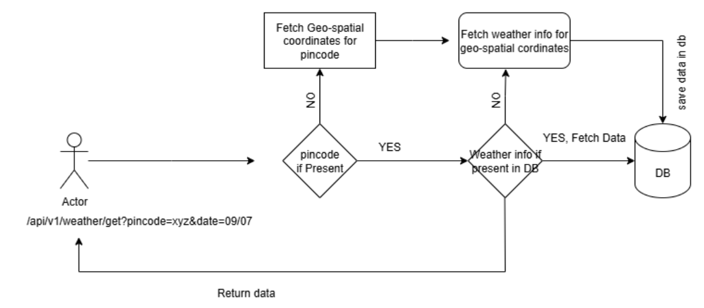

# Fetch weather API ☁️
This github repository is Spring boot microservice which has an API
that shows weather condition for a given date and given pincode.

**NOTE**
+ This API gives weather information for a given date if 
  + The weather information for the given date is present in system
  + Or if the given date is not older or greater than the current date then it calls open weather API, fetches weather information 
    for current date, saves it and gives it in response. 
  + Else it will show weather details not present.

This microservice is built using these technologies
+ **JAVA 17**
+ **Spring boot 3.5.3**
+ **MySQL 8**

**Weather API FLOW DIAGRAM**

🚀**How to run the API and test:**
+ Clone this repo
+ Required environment variables to start the application:
  + export your MySQL database host into MYSQL_DATABASE_HOST variable or else localhost is considered default
  + export your MySQL database password into MYSQL_DATA_BASE_PASSWORD variable. Make sure you export this or else you 
    won't be able to run the application.
  + Also make sure your localhost port 8080 is free, if not feel free to change the port of application by adding different value to server.port in application.properties or application.yml
  + Get an API key by logging in to https://openweathermap.org portal from your accounts section.
  + export the API key you got from OpenWeatherMaps into OPEN_WEATHER_APP_ID variable.
  + That's it you will be able to run the application successfully.
+ you can access the swagger API documentation for this API using http://localhost:8080/swagger-ui/index.html, please note the port in swagger url might be different if you run application on different port.
+ you will be able to see the API which accepts pincode and Date as request parameters.
+ Don't wait!! Go, give your pincode, current_date and fire it🔥.